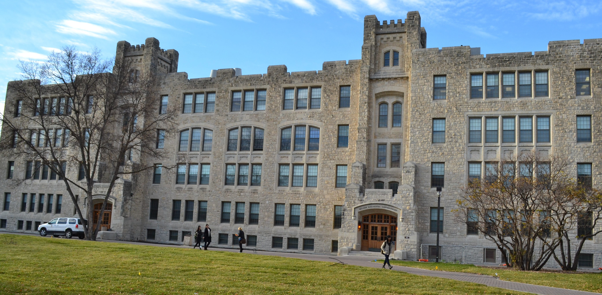

  
I will be joining the Department of Microbiology at the University of Manitoba effective July 1st, 2019.  
  
You can reach me at [Matthew.Bakker@umanitoba.ca](mailto:Matthew.Bakker@umanitoba.ca) or +1-204-474-7297.  

Office location: 
414B Buller Building; [map here](http://umanitoba.ca/maps/){target="_blank"}
<figure>
  
  <figcaption>*photo by Lucas Teles, via wikimedia CC-BY-SA*</figcaption>
</figure>

Mailing address: 
Department of Microbiology
213 Buller Building
45 Chancellor's Circle
University of Manitoba
Winnipeg, MB R3T 2N2
Canada

 

 

  
  
