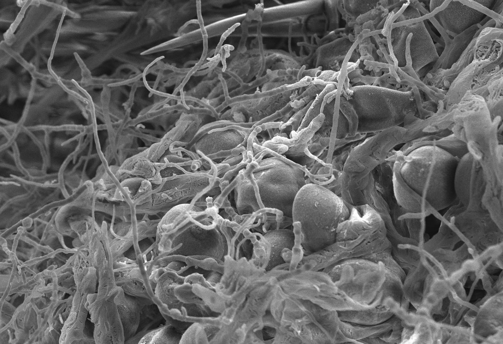

Research in the Bakker lab investigates plant-microbe interactions and plant-associated microbiomes, particularly in relation to agricultural productivity and sustainability.  
  
We are in the [Department of Microbiology](http://www.sci.umanitoba.ca/micro/){target="_blank"} at the [University of Manitoba](https://umanitoba.ca/){target="_blank"} effective 1 July 2019.

<div style= "float:right;position: relative; top: -250px;">
```{r, cache = FALSE, echo = FALSE, fig.cap = "*Fusarium graminearum* colonizing a kernel of wheat", dpi = 600}

```
</div>

