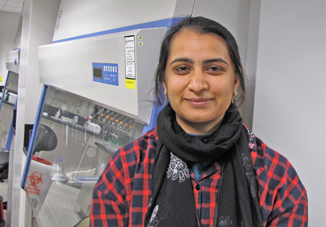

  
# Current lab members  
```{r echo = FALSE, fig.align = "right", out.width = '30%', out.extra = 'style = "float:right; padding:10px"'}

```

### Dr. Matthew Bakker  
Matt completed his PhD in Plant Pathology ([University of Minnesota](https://plpa.cfans.umn.edu/){target="_blank"}) in 2011. He did a post-doc at [Colorado State University](https://www.colostate.edu/){target="_blank"} and worked as a staff scientist with the [U.S. Department of Agriculture](https://www.ars.usda.gov/){target="_blank"} for six years. He joins the [Department of Microbiology](http://www.sci.umanitoba.ca/micro/){target="_blank"} at the [University of Manitoba](https://umanitoba.ca/){target="_blank"} effective 1 July 2019.  
<p></br></p>
<p></br></p>

# Lab alumni  
```{r echo = FALSE, fig.align = "right", out.width = '30%', out.extra = 'style = "float:right; padding:10px"'}

```
  
### Hina Shanakhat  
PhD student intern; currently a Ph.D. student in Agriculture and Food Sciences at the University of Naples Federico II  
<p></br></p>
<p></br></p>
<p></br></p>

```{r echo = FALSE, fig.align = "right", out.width = '30%', out.extra = 'style = "float:right; padding:10px"'}

```

### [Dr. Briana Whitaker](https://brianakwhitaker.wixsite.com/ecology){target="_blank"}  
PhD student intern; currently a post-doc at the University of North Carolina - Chapel Hill  
[Bacterial endophyte antagonism toward a fungal pathogen in vitro does not predict protection in live plant tissue](https://doi.org/10.1093/femsec/fiy237){target="_blank"}  
<p></br></p>
<p></br></p>
<p></br></p>

### Jake Brown  
Technician; currently a technician with the U.S. Department of Agriculture  
  
### Nathan Kemp  
Technician; currently a technician with the U.S. Department of Agriculture  
  
### Kelsey Roberts  
Undergraduate summer intern  