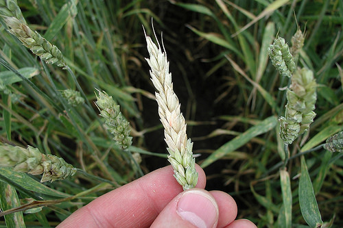

Research in the Bakker lab investigates plant-microbe interactions and plant-associated microbiomes, particularly in relation to agricultural productivity and sustainability.

# Fusarium head blight of small grains

text

# Microbiome dynamics during malting
## Current MSc position open!

By Peter Schill - Self-photographed, CC BY-SA 2.0 de, https://commons.wikimedia.org/w/index.php?curid=27955443
text