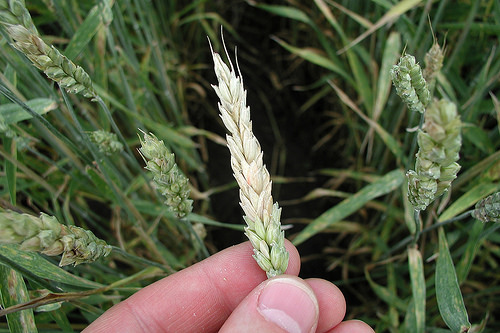
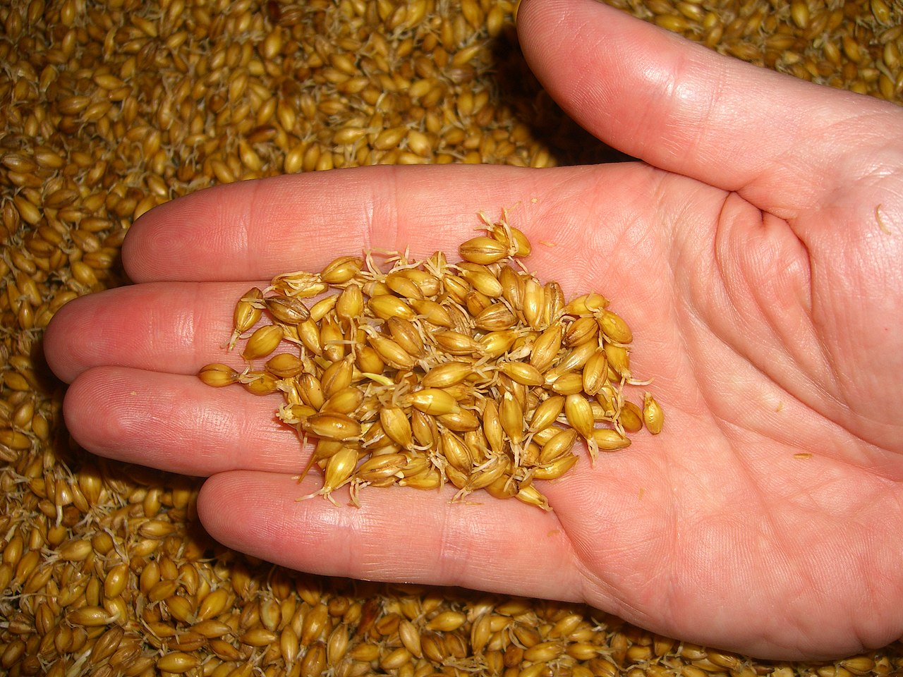
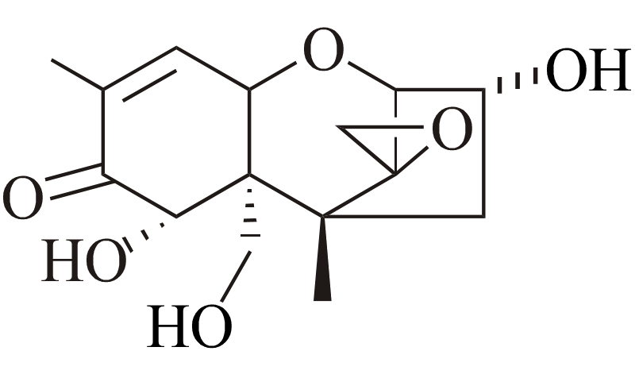

  
Research in the Bakker lab investigates plant-microbe interactions and plant-associated microbiomes, particularly in relation to agricultural productivity and sustainability. Some of our current study systems include:  
  
  
### Fusarium head blight of small grains  
<figure>
  
  <figcaption>*Fusarium head blight; image curtesy of U.S. Department of Agriculture*</figcaption>
</figure> 
One of the important functions performed by plant-associated microbiomes is the suppression of plant pathogens. We use the plant disease fusarium head blight as a model system for study of microbiome-pathogen interactions. This disease is economically costly, and is associated with accumulation of mycotoxins that create a food safety hazard.  
  

 

 

 

 

  
### Microbiome dynamics during malting  
<figure>
  
  <figcaption>*Image by Peter Schill, via wikimedia CC BY-SA 2.0 de*</figcaption>
</figure> 
Malting is a process of controlled germination that is used to stimulate enzymes within barley seeds to begin converting starch into sugars. While not the target of management, there is also a lot of microbial activity that takes place during malting. We study microbiome dynamics during malting, particularly with connections to the activity of *Fusarium* spp., which have been linked to some malt quality defects.  

#### [Current MSc position open!](media/Fusarium_MaltingBarley_MScPosition_UManitoba.pdf)  
  

 

 

 

 

  
### Microbial detoxification of mycotoxins  
<figure>
  
  <figcaption>*Chemical structure of the mycotoxin deoxynivalenol*</figcaption>
</figure> 
The amazing metabolic abilities of the microbial world are still largely unknown. We are doing our small part to uncover this vast potential by prospecting for microbes and enzymes that are able to chemically transform mycotoxins such as deoxynivalenol.  
