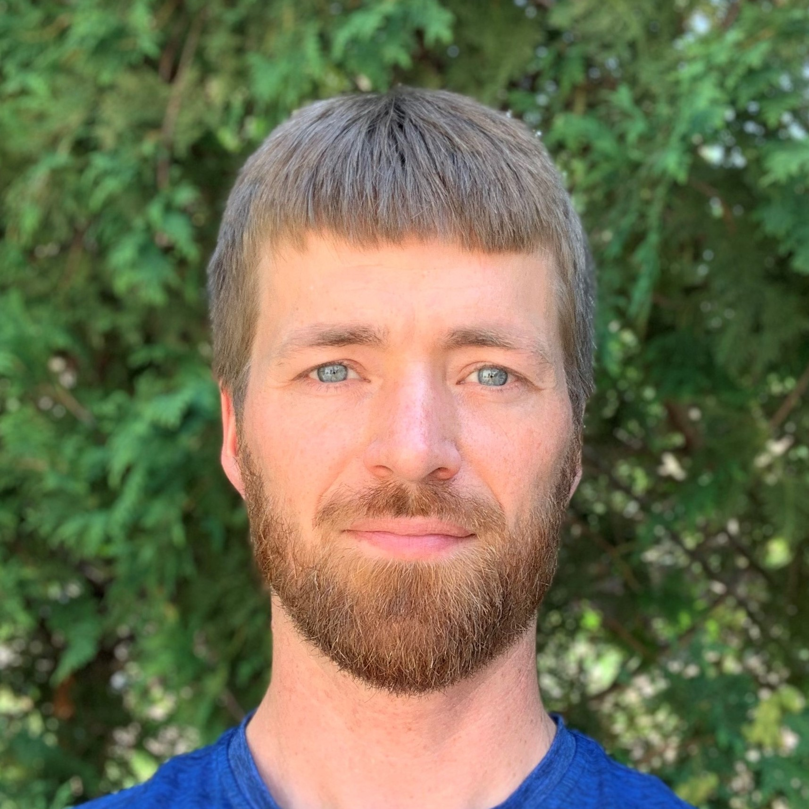
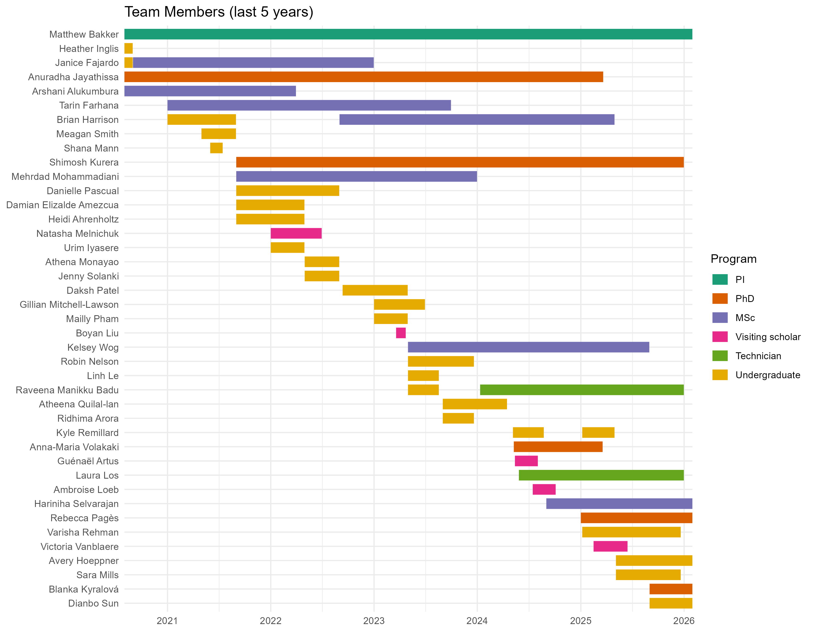

```{r echo = FALSE, fig.align = "right", out.width = '30%', out.extra = 'style = "float:right; padding:10px"'}

```

### [Dr. Matthew Bakker](https://www.linkedin.com/in/mattbakker/){target="_blank"}
*Principal investigator.*\
Matthew completed his PhD in Plant
Pathology at the [University of
Minnesota](https://plpa.cfans.umn.edu/){target="_blank"}. He did a
post-doc at [Colorado State
University](https://www.colostate.edu/){target="_blank"} and worked as a
staff scientist with the [U.S. Department of
Agriculture](https://www.ars.usda.gov/){target="_blank"} before joining
the [Department of
Microbiology](http://www.sci.umanitoba.ca/micro/){target="_blank"} at
the [University of Manitoba](https://umanitoba.ca/){target="_blank"}.
Matthew teaches *Microbes In Our Environment*, *Introductory
Biogeochemistry*, and contributes to *Graduate Microbiology* and to
*Evolution of Fungal Pathogens*.

<p></br></p>
<p></br></p>
<p></br></p>
<p></br></p>

```{r echo = FALSE, fig.align = "right", out.width = '30%', out.extra = 'style = "float:right; padding:10px"'}
knitr::include_graphics("media/Jayathissa_Anuradha_2021.jpg")
```

### [Anuradha Jayathissa](https://www.linkedin.com/in/anuradha-jayathissa-70b6611b0/){target="_blank"}
*PhD candidate (co-advised with [Dr. Dilantha
Fernando](https://sites.google.com/view/dilanthafernando/what-does-the-lab-specialize-in){target="_blank"}).*\
Anuradha is studying impacts of *Fusarium* spp. on malt quality, and
investigating hydrophobin proteins produced by *Fusarium*. Anuradha is
an alumnus of the [EvoFunPath training
program](https://twitter.com/evofunpath?lang=en){target="_blank"}.


<p></br></p>
<p></br></p>
<p></br></p>
<p></br></p>
<p></br></p>

```{r echo = FALSE, fig.align = "right", out.width = '30%', out.extra = 'style = "float:right; padding:10px"'}
knitr::include_graphics("media/Kurera_Mayantha.jpg")
```

### [M. Shimosh Kurera](https://www.linkedin.com/in/mayantha-kurera-ba22981b1/){target="_blank"}
*PhD student (co-advised with [Dr. Sean
Walkowiak](https://www.grainscanada.gc.ca/en/about-us/contact-us/sc-exp/sean-walkowiak.html){target="_blank"}).*\
Shimosh is developing methods for rapidly identifying unknown *Fusarium*
and rust strains via MALDI biotyping. Shimosh is an alumnus of the
[EvoFunPath training
program](https://twitter.com/evofunpath?lang=en){target="_blank"}.


<p></br></p>
<p></br></p>
<p></br></p>
<p></br></p>
<p></br></p>

### Brian Harrison
*MSc student.*\
Brian is researching trichothecene mycotoxins that are produced by the
fungal plant pathogen *Fusarium graminearum*. Brian is an alumnus of the
[EvoFunPath training
program](https://twitter.com/evofunpath?lang=en){target="_blank"}.


<p></br></p>
<p></br></p>
<p></br></p>

### [Kelsey Wog](https://www.linkedin.com/in/kelsey-wog-ab438621b/){target="_blank"}
*MSc student (co-advised with [Dr. Aleeza
Gerstein](https://www.microstatslab.ca/){target="_blank"}).*\
Kelsey is studying the evolution of resistance towards fungicides in
*Fusarium graminearum*.

<p></br></p>

```{r echo = FALSE, fig.align = "right", out.width = '30%', out.extra = 'style = "float:right; padding:10px"'}

```

### [Raveena Manikku Badu](https://www.linkedin.com/in/raveena-manikku-badu-5b827410a/){target="_blank"}
*Technician.*\
Raveena helps keep the lab running smoothly, and
researches impacts of soil bacteria on plant roots.

<p></br></p>
<p></br></p>
<p></br></p>
<p></br></p>
<p></br></p>

## Lab alumni

Atheena Quilal-lan, *Undergraduate*

[Mehrdad Mohammadiani](https://www.linkedin.com/in/mehrdad-mohammadiani-733051232/){target="_blank"}, *MSc*

[Tarin Farhana](https://www.linkedin.com/in/tarin-farhana-59371268/){target="_blank"}, *MSc*

Ridhima Arora, *Undergraduate*

[Robin Nelson](https://www.linkedin.com/in/robin-nelson-a83061268){target="_blank"}, *Co-op*

[Raveena Manikku Badu](https://www.linkedin.com/in/raveena-manikku-badu-5b827410a/){target="_blank"}, *Co-op*

[Linh Le](https://www.linkedin.com/in/linh-le-2b256a1a2/){target="_blank"}, *Undergraduate summer research*

Gillian Mitchell-Lawson, *Co-op*

[Mailly Pham](https://www.linkedin.com/in/phuong-pham-47175b242/){target="_blank"}, *Co-op*

[Daksh Patel](https://www.linkedin.com/in/daksh-patel-63b605225/){target="_blank"}, *Co-op*

[Janice Fajardo](https://www.linkedin.com/in/janice-fajardo/){target="_blank"}, *MSc*

[Natasha Melnichuk](https://www.linkedin.com/in/natasha-melnichuk-854415151/){target="_blank"}, *PhD student intern*

[Danielle Pascual](https://www.linkedin.com/in/danielle-pascual-1556191b9/){target="_blank"}, *Co-op*

[Athena Monayao](https://www.linkedin.com/in/athena-hillary-monayao-9741841b7/){target="_blank"}, *Co-op*

[Jenny Solanki](https://www.linkedin.com/in/jenny-solanki-98930920a/){target="_blank"}, *Undergraduate summer research*

Urim Iyasere, *Co-op*

[Arshani Alukumbura](https://www.linkedin.com/in/arshani-alukumura-9b1a64152/){target="_blank"}, *MSc*\
[Minimal impacts on the wheat microbiome when *Trichoderma gamsii* T6085 is applied as a biocontrol agent to manage fusarium head blight disease](https://www.frontiersin.org/articles/10.3389/fmicb.2022.972016/full){target="_blank"}

Heidi Ahrenholtz, *Co-op*

Damian Elizalde Amezcua, *Undergraduate honours*

[Meagan
Smith](https://www.linkedin.com/in/meagan-smith-5a6683213/){target="_blank"},
*Undergraduate summer research*

Shana Mann, *Indigenous Summer Student Intern*

Heather Inglis, *Undergraduate*

[Shaima Eissa](https://www.linkedin.com/in/shaimaa-eissa-msc-136013112/){target="_blank"},
*Lab Technician III*

```{r echo = FALSE, fig.align = "left", out.width = '90%'}

```

## Lab alumni from US Department of Agriculture
[Dr. Hina Shanakhat](https://www.researchgate.net/profile/Hina_Shanakhat){target="_blank"},
*PhD student intern*\
[Modification of deoxynivalenol by a fungal laccase paired with redox mediator TEMPO](https://www.mdpi.com/2072-6651/14/8/548){target="_blank"}

[Dr. Briana Whitaker](https://www.ars.usda.gov/midwest-area/peoria-il/national-center-for-agricultural-utilization-research/mycotoxin-prevention-and-applied-microbiology-research/people/briana-whitaker/){target="_blank"}, *PhD student intern*\
[Bacterial endophyte antagonism toward a fungal pathogen *in vitro* does not predict protection in live plant tissue](https://doi.org/10.1093/femsec/fiy237){target="_blank"}

[Jake Brown](https://www.ars.usda.gov/midwest-area/peoria-il/national-center-for-agricultural-utilization-research/mycotoxin-prevention-and-applied-microbiology-research/people/jacob-brown/){target="_blank"}, *Technician*

[Nathan Kemp](https://www.ars.usda.gov/people-locations/person?person-id=53790){target="_blank"}, *Research Associate*\
[*Sarocladium zeae* is a systemic endophyte of wheat and an effective biocontrol agent against fusarium head blight](https://doi.org/10.1016/j.biocontrol.2020.104329){target="_blank"}

Kelsey Roberts, *Undergraduate summer research*
